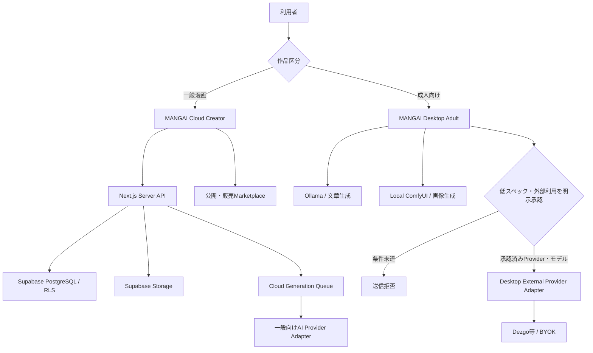

# MANGAI Cloud／Desktop Adult 製品開発計画

作成日: 2026-07-18

対象ブランチ: `feature/manga-canvas-mvp`

## 1. 決定した製品方針

MANGAIを、コンテンツ区分とAI実行場所が異なる2製品として開発する。

| 製品                 | 対象         | 制作環境        | AI実行                                                                        | 秘密情報                   |
| -------------------- | ------------ | --------------- | ----------------------------------------------------------------------------- | -------------------------- |
| MANGAI Cloud         | 一般漫画     | Webブラウザー   | MANGAI管理の一般向けAI API                                                    | Serverだけで保持           |
| MANGAI Desktop Adult | 成人向け漫画 | Windows Desktop | OllamaとローカルComfyUIを優先。低スペック端末は承認済み外部Providerを任意利用 | BYOKはOS keyringだけで保持 |

Desktopでいう「ローカルLLM」は文章生成を行うOllamaを指す。画像生成はローカルComfyUIを使用する。Dezgoはローカル画像生成が困難な端末向けの補助Providerであり、固定基盤にはしない。

成人向け作品、Prompt、参照画像、完成PageをMANGAI Cloudの一般向けAIへ送信しない。成人向け外部生成はProviderとモデルの利用条件を確認できる場合だけ、Desktopの専用経路で有効化する。

## 2. 現在地

### 2.1 再利用できる実装

- MANGAI Hubの認証、作品公開、商品、Stripe、販売、グッズ申請、管理者機能
- MANGAI DesktopのProject、Episode、Page、Canvas、素材、レイヤー、吹き出し、縦書き、Undo / Redo
- `project-core`、`canvas-core`、`export-core`、`ai-core`の共通package
- DesktopのOllama、ComfyUI、永続Queue、Runtime Profile、Asset Library、生成履歴
- Project外部送信ポリシーとfail-closed Generation Router
- Dezgo BYOK、OS keyring、モデル・残高・費用、safe素材1枚生成、直列dispatcher
- 成人向け年齢確認、内容確認、Provider承認registry、署名済みpolicy取込、承認失効時のJob停止
- Windows installer、自動更新、バックアップ、診断、日英表示、axe自動監査

### 2.2 大きな不足

- MANGAI HubはMarketplaceであり、ブラウザー上のCloud Creator Editorではない
- Cloud用Project、Page、Canvas、Asset、生成履歴のDBとRLSがない
- 一般向けAI APIを実行するServer Queue、Provider adapter、費用・quota基盤がない
- Cloud Creator本体のProject・Canvasデータ基盤は未実装（製品境界の共通契約はPhase 0で実装済み）
- 成人向けDezgo専用dispatcherと実運用承認データがない
- Supabase、Stripe、Vercel、Ollama、ComfyUI、Dezgoの実環境RC受入れが未完了

## 3. 目標アーキテクチャ



### 3.1 変更境界

- HubのMarketplace機能を維持し、Cloud Creatorを`/creator`配下へ段階追加する
- Electron main process固有コードをWebへ移植しない
- 共通の型、validation、Canvas計算、Project manifestだけをpackagesへ抽出する
- 長時間AI生成をVercel request内で完結させず、永続Queueとworkerへ分離する
- Cloud Provider keyをブラウザー、DB、ログ、生成履歴へ露出しない
- Desktop BYOK keyをHubへ同期しない

## 4. 共通製品契約

最初に次の共通型を追加し、CloudとDesktopの両方で同じ判定を使用する。

```typescript
type ContentClass = "general" | "adult";
type ProductSurface = "cloud" | "desktop";
type ExecutionTarget = "cloud_provider" | "local" | "external_byok";

interface ContentExecutionPolicy {
  contentClass: ContentClass;
  productSurface: ProductSurface;
  allowedTargets: ExecutionTarget[];
  externalConfirmationRequired: boolean;
}
```

必須ルール:

- `general + cloud`は承認済み一般向けProviderだけを利用可能
- `adult + cloud`はProject作成、同期、生成を拒否
- `adult + desktop`はlocalを既定にする
- `adult + external_byok`は年齢確認、管理者許可、Provider・モデル承認、毎回確認、費用上限をすべて再評価する
- 区分不明、古いProject、検証不能な入力は成人向けとして外部送信を拒否する
- rendererやブラウザーから送られた判定結果を信用せず、ServerまたはElectron mainで再判定する

## 5. 開発フェーズ

### Phase 0: 製品境界と安全契約（2026-07-18 完了）

目的: 一般向けCloudと成人向けDesktopの混線を先に防ぐ。

実装:

- `ContentClass`、`ProductSurface`、`ContentExecutionPolicy`の共通schema
- 新規Project作成時の一般／成人向け選択
- 成人向けProjectのCloud API、Cloud Storage、一般向けAI APIへの送信拒否
- 販売パッケージmanifestへの区分・作成surface・policy version追加
- 一般から成人向けへ変更した時のCloud同期停止とローカル移行案内
- 既存Projectの区分移行。曖昧なデータはfail closed
- 日英の規約・プライバシー・外部送信表示
- 境界matrixの単体・IPC・API・RLS否定テスト

完了条件:

- 成人向けfixtureを使ったCloud保存・生成要求がすべて拒否される
- 一般向けProjectは既存Marketplace導線を維持する
- UI改変だけでは境界を回避できない

完了記録と検証証跡は[Phase 0完了報告](PHASE0_PRODUCT_BOUNDARY_COMPLETION.md)を参照する。

### Phase 1: Cloud Creatorデータ基盤

状態: **完了（2026-07-18）**。実装範囲と検証証跡は[Phase 1完了報告](PHASE1_CLOUD_CREATOR_FOUNDATION_COMPLETION.md)を参照する。

目的: ブラウザー編集を保存できる安全な土台を作る。

実装:

- `cloud_projects`、`cloud_episodes`、`cloud_pages`
- `cloud_assets`、`cloud_canvas_snapshots`、`cloud_project_versions`
- 所有者、共同作業者候補、管理者、公開利用者のRLS
- 一般向けProjectだけを許可するDB制約とServer validation
- 非公開Storage bucket、署名URL、MIME・容量・画像decode検証
- 自動保存用revisionと楽観的lock
- Soft delete、復元、保存容量集計
- Desktop一般向けProjectのimport contract
- forward / rollback migrationとstaging preflight

完了条件:

- 別ユーザーの非公開Projectと素材を取得できない
- Page変更を再読込後に復元できる
- 競合更新を上書きせず検出できる
- 成人向けmanifestをimportできない

上記4条件はローカルのPostgreSQL 16、Hub単体テスト、Desktop統合テストで確認済み。実Supabase stagingへの適用は、外部環境を使用するRC受入れとして別管理する。

### Phase 2: Cloud Creator Editor MVP

目的: 一般漫画をブラウザーだけで制作できるようにする。

実装順:

1. Project一覧、新規作成、Episode・Page管理
2. 素材アップロード、Asset Library、Canvas配置
3. コマ、レイヤー、移動、拡縮、回転、順序、opacity
4. 吹き出し、横書き・縦書き、ルビ
5. 自動保存、Undo / Redo、保存状態、競合表示
6. Page preview、表紙、代表画像
7. PDF、連番画像、販売パッケージの非同期export
8. keyboard、モバイル閲覧、主要操作のアクセシビリティ

再利用方針:

- geometry、text layout、validationは`canvas-core`を利用
- Project manifestは`project-core`を拡張
- 書き出し規則は`export-core`を利用し、Server worker adapterを追加
- Desktop React画面をそのままコピーせず、Web用I/O adapterを作る

完了条件:

- 一般向け3Page作品をブラウザーだけで作成・再編集・書き出しできる
- Desktopと同じfixtureから主要Canvas要素が同等に描画される
- 主要編集操作でデータ消失がない

### Phase 3: 一般向けCloud AI

目的: 一般漫画制作に一般向けAI APIを安全に接続する。

実装:

- Server専用`CloudImageGenerationProvider`と`CloudTextGenerationProvider`
- Provider capability、モデル、規約version、価格情報のregistry
- 最初の画像Provider 1社と文章Provider 1社
- 永続Cloud Queue、worker、進捗、cancel、限定retry、idempotency key
- Provider webhook / pollingの検証
- Prompt補助、背景・小物・キャラクター生成
- 生成画像の検証、metadata除去、Storage保存
- 一般向けmoderationと拒否理由
- 成人向け・実在人物・権利侵害リスク入力の送信前拒否
- 生成履歴、Seed、モデル、parameter、実費、所要時間
- Provider停止、model無効化、fallback
- Prompt本文を通常ログ・クラッシュログへ保存しない

完了条件:

- 一般向けfixtureを1枚生成しPageへ配置できる
- 同じJobを二重課金せず再開できる
- 成人向けfixtureはProviderへ1byteも送信されない
- Provider停止中も編集・保存・書き出しを継続できる

### Phase 4: Cloud quota・課金・Marketplace統合

目的: API原価を制御し、制作から販売まで接続する。

実装:

- Free / trial / paid planと月間生成credit
- Job前の残quota・推定上限確認
- Provider実費ledger、予約、確定、解放、日次集計
- ユーザー、Project、IP単位のrate limit
- 予算警告、自動停止、管理者kill switch
- CheckoutまたはSubscriptionとのentitlement連携
- Cloud Creatorから非公開作品・停止中商品を作成
- 表紙、sample、販売ファイルの差分確認付き受け渡し
- 購入者アカウント、購入履歴、再ダウンロード
- メール通知と運用監視

完了条件:

- quota超過時にProviderへ送信されない
- 予約額と実費がJob・ユーザー・Project単位で一致する
- 一般作品を制作、非公開登録、公開、テスト購入、downloadまで完走できる

### Phase 5: Desktop Adult ローカル実用化

目的: 成人向け制作を外部送信なしで完結できるようにする。

実装:

- 成人向けProject開始時の専用確認
- Ollama推奨モデル、ComfyUI推奨workflowの導入ガイド
- モデルlicenseと利用条件の端末内表示
- キャラクターprofileと参照素材管理
- Image-to-Image、ControlNet、Inpaintingを1機能ずつ追加
- 顔・手・一部分だけの修正workflow
- 低VRAM向け解像度、tiled VAE、CPU offloadの実機preset
- Project単位の暗号化・画面privacy機能を別要件として評価
- 成人向けPrompt・画像を診断・クラッシュログへ含めない否定テスト
- 8GB / 12GB / 16GB以上のWindows実機E2E

完了条件:

- 外部通信を遮断したPCで作成、生成、修正、保存、書き出しが完走する
- 低VRAM設定でクラッシュせず1枚生成できる
- 成人向け一括生成は明示的に解禁するまで拒否される

### Phase 6: 低スペック向け成人対応外部Provider

開始条件:

- Providerから成人向け商用API利用の確認可能な承認証跡がある
- 対象モデルのlicense・利用条件を確認できる
- 本番用署名公開鍵とpolicy bundle運用が決まっている
- 非成人向けDezgo 10枚E2Eが合格している

実装:

- safe素材dispatcherと分離した成人向け専用dispatcher
- 送信直前の年齢確認、管理者設定、Project区分、Provider・モデル承認再評価
- 1操作1枚、同時実行1件、batch禁止
- Promptだけを送るText-to-Imageから開始
- 毎回の外部送信・規約・費用確認
- 日次、Project、利用者月間上限
- timeout後の二重課金防止
- 承認失効時のqueued / paused Job停止と費用予約解放
- 成人向け20枚の限定受入れ

完了条件:

- 不完全な承認、未成年・年齢曖昧、実在人物、同意欠落をfail closedで拒否する
- 実測で費用、時間、一貫性、再生成率、修正率を記録する
- Dezgo固有処理をProvider adapter外へ漏らさず、別Providerへ差し替え可能にする

承認条件を満たせない場合、Phase 6は実装・公開せず、Desktopローカル生成だけで提供する。

### Phase 7: Release Candidate・公開

- Supabase staging migration / rollback
- Stripe test成功・失敗・返金・download E2E
- Vercel preview / production環境
- Windowsコード署名
- 署名付き自動更新E2E
- Ollama、ComfyUI、Dezgo対象範囲の実サービスE2E
- クリーンWindows、Narrator、高コントラスト、150%表示
- SBOM、checksum、依存脆弱性、バックアップ復旧訓練
- 利用規約、プライバシーポリシー、成人向け規約、Provider開示
- CloudとDesktopを別々にRC判定する

## 6. 優先バックログ

| 優先       | Epic                          | 主な完了条件                                |
| ---------- | ----------------------------- | ------------------------------------------- |
| P0         | 製品境界強制                  | 成人向けデータがCloudへ送られない           |
| P0         | Cloud Project DB / RLS        | 所有者だけが非公開制作データへアクセス可能  |
| P0         | Cloud Editor MVP              | 3Page作品を作成・保存・書き出し可能         |
| P0         | Cloud AI Queue                | 一般向け1枚生成、二重課金なし、成人向け拒否 |
| P0         | Cloud quota / cost ledger     | 上限超過を送信前に停止                      |
| P0         | Desktopローカル実機E2E        | 低VRAM PCで1枚生成・書き出し成功            |
| P0         | 公開基盤                      | staging、本番、署名、更新、決済受入れ完了   |
| P1         | キャラクター一貫性            | profile、参照素材、履歴再利用               |
| P1         | Local Image-to-Image          | 成人向けをローカルだけで修正可能            |
| P1         | Local ControlNet              | ポーズ・構図制御をローカルで実行            |
| P1         | Local Inpainting              | 部分修正をローカルで実行                    |
| 条件付きP1 | 成人向け外部Provider          | 承認証跡と専用dispatcherが揃った場合のみ    |
| P2         | 共同編集                      | revision基盤安定後に導入                    |
| P2         | 複数Cloud Provider自動routing | 最初のProvider運用実績後に導入              |

## 7. テスト戦略

### 自動テスト

- 共通policy matrixの全組み合わせ
- API、IPC、DB、RLSの成人向け送信拒否
- Cloud Project CRUD、revision競合、Storage認可
- Canvas fixtureのDesktop / Cloud描画比較
- Provider mock、timeout、429、5xx、cancel、idempotency
- quota予約・確定・解放と並行Job
- Prompt、API key、画像byteのログ非露出
- migration forward / rollback
- TypeScript、ESLint、unit、integration、production build、axe

### 手動E2E

- Cloud一般作品: 作成からAI生成、書き出し、公開、テスト購入
- Desktop成人向け: offline作成、ローカル生成、部分修正、書き出し
- 低スペックPC: Runtime Profile、ComfyUI、アプリ継続動作
- 成人向け外部Provider: 開始条件を満たした場合だけ限定実施

## 8. 主要リスクと停止条件

| リスク                       | 対応・停止条件                                          |
| ---------------------------- | ------------------------------------------------------- |
| 一般／成人向けデータ混線     | Phase 0が未完了ならCloud AI実装へ進まない               |
| Provider規約変更             | registry失効、Job停止、model allowlist無効化            |
| API原価超過                  | 予約ledgerとhard quotaがない状態で公開しない            |
| Serverless timeout           | Queue workerへ分離しrequest内生成を禁止                 |
| 成人向けProvider承認不足     | Dezgo成人向けを有効化しない                             |
| 低スペックでローカル生成不能 | 実機測定後に対応profileを明示し、過大な動作保証をしない |
| DesktopとCloudの機能差       | 共通fixtureとProject manifest互換testを維持             |
| 秘密値・Prompt漏えい         | redaction否定テストとログ保存範囲をrelease gate化       |

## 9. 見積もりの扱い

実人数が未確定のため、暦日ではなく実装iterationで管理する。1 iterationは、設計・実装・test・文書・reviewを含む1つの小さな成果単位とする。

| フェーズ                     | 目安iteration | 依存              |
| ---------------------------- | ------------: | ----------------- |
| Phase 0 製品境界             |          3〜5 | なし              |
| Phase 1 Cloudデータ基盤      |          5〜8 | Phase 0           |
| Phase 2 Cloud Editor MVP     |        10〜16 | Phase 1           |
| Phase 3 Cloud AI             |         8〜12 | Phase 0、1        |
| Phase 4 quota・Marketplace   |         6〜10 | Phase 3           |
| Phase 5 Desktop Adult local  |         8〜14 | 既存Desktop基盤   |
| Phase 6 成人向け外部Provider |          5〜9 | 外部承認、Phase 5 |
| Phase 7 RC                   |          5〜8 | 対象製品の各Phase |

Cloud系とDesktop local系はPhase 0の契約確定後に並行可能。Phase 6は外部承認待ちのため、全体公開のクリティカルパスに置かない。

## 10. 最初の2 iteration

### Iteration 1: 製品区分をコードで強制

- ADRと共通policy schema
- Project / sales packageの`contentClass`
- Cloud APIのadult拒否middleware
- Desktop Project区分の移行
- policy matrix test
- 利用者向け表示文

### Iteration 2: Cloud Project最小保存

- Supabase migrationとrollback
- Project、Episode、Page、Canvas snapshot
- RLSと別ユーザー拒否test
- `/creator`のProject一覧・作成・再オープン
- autosave revisionの最小実装
- 成人向けProject作成拒否test

## 11. 今回の対象外

- 成人向けCloud Creator
- 成人向け作品の一般向けCloud AI送信
- Provider承認前の成人向けDezgo有効化
- 初期段階での複数Cloud Provider自動最適化
- 20 / 100 / 200Pageの無人一括生成
- 自社GPU基盤
- リアルタイム共同編集
- AI生成物の法的保証

## 12. 計画の完了判定

次の2つを独立して判定する。

### MANGAI Cloud RC

- 一般向けProjectをCloudだけで作成・生成・書き出し・公開・テスト購入できる
- 成人向け入力をCloud保存・一般向けProvider送信の両方で拒否できる
- quota、費用、RLS、バックアップ、監視が合格している

### MANGAI Desktop Adult RC

- offlineで成人向けProjectを作成・ローカル生成・修正・書き出しできる
- Windows署名、更新、低スペック実機、privacy受入れが合格している
- 成人向け外部Providerは、承認条件を満たす場合だけ追加の合格項目とする
