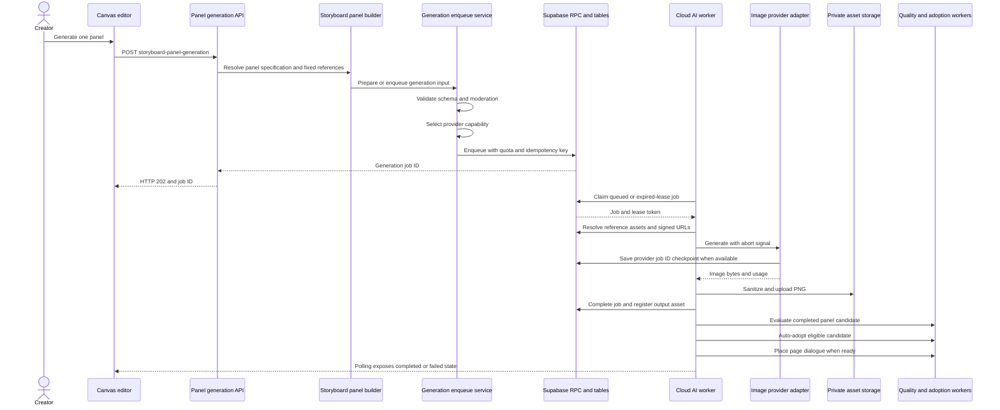

# P0生成基盤・OSS比較調査

作成日: 2026-08-24

Branch: `codex/research-p0-generation-foundation`

Base: `4d7b9fae512f0530f6848a2bca49a240ccbe3ce7`（PR #336 merge commit）

## 1. 結論

P0を新規に作り直す必要はない。現行Cloud生成経路には、コマ単位Job、DB queue、idempotency、lease、指数backoff、Provider Job IDの保存、確定Assetの非公開Storage保存、失敗Jobのコマ単位再実行、batch、作品checkpointが既にある。

ただし、指示された受入条件に対して次が不足する。

1. 永続Job状態が`queued / running / completed / failed / canceled`の5状態だけで、`PREPARING / GENERATING / VALIDATING`を再起動後に識別できない。
2. `FAILED_RETRYABLE / FAILED_FINAL`はstatusではなく、`retryable`判定と`attempt_count / max_attempts`から間接的に扱われる。
3. 手動再試行は新Jobを作るが、元Jobとの系譜をDB列で追跡できない。
4. HTTP status、失敗工程、次に安全に再開できる工程を構造化保存していない。
5. `provider_job_id`は外部非同期Jobの再pollに使えるが、全Provider共通の工程checkpointではない。
6. 作品checkpointは作品全体の復元用であり、長編生成runの進捗ledgerではない。
7. コマはCanvas内UUIDとして存在し、独立した正規化tableではない。生成Jobは`input.targetPanelId`でコマを参照する。

したがってP0は、既存経路を残し、追加table／列とFeature Flagで観測・再開契約を段階導入する。既存statusの一括置換、既存Jobの再生成、Provider変更は行わない。

## 2. 現行生成シーケンス



### 2.1 入力からqueueまで

- Entry point: `POST /api/creator/storyboard-panel-generation`。
- Feature Flag、request rate limit、認証・作品所有権をfail-closedで確認する。
- Storyboard、Canvas、人物／場所／小物割当、Style Bible、参照Asset、source page revisionからコマ生成入力を構築する。
- `prepareCloudGenerationJob`がinput schema、一般向けmoderation、Provider capabilityを確認し、prompt本体ではなくSHA-256をJob列へ保存する。
- `enqueue_cloud_generation_job_with_quota`がquota／料金上限を確認し、credit予約とJob作成を同じDB契約内で行う。
- `(created_by_profile_id, idempotency_key)`が一意で、同じ要求の二重enqueueを抑止する。

### 2.2 Workerと再開

- Workerは`FOR UPDATE SKIP LOCKED`で1件をclaimし、lease tokenと期限を取得する。
- `queued`、またはlease期限切れの`running`だけが再claim対象である。
- heartbeatがleaseを延長し、lease喪失後のDB完了確定を拒否する。
- Providerが非同期IDを返す場合、`provider_job_id`をJobへcheckpointする。
- timeout時にProvider Job IDがあり開始後30分以内なら、Jobをdeferして同じProvider Jobを再pollする。
- retryable失敗は最大試行数内だけ`queued`へ戻り、`5 * 2^(attempt-1)`秒後に再試行する。
- 完了済みJobとAssetの組合せを再確認し、DB完了後に例外が発生してもAssetを再生成しない。

### 2.3 Asset確定と後処理

- Provider出力を検査・正規化し、非公開StorageへPNGとして保存する。
- DB完了に失敗した孤児Storage objectは即時削除し、削除失敗もcleanup queueへ保存する。
- 完了後の品質評価、候補採用、セリフ配置はbest-effortで、画像Jobを失敗へ戻さない。後続Workerがreconcileする。

## 3. エラー経路と現在の動作

|工程|主な失敗|現在の分類・保存|再試行／保存動作|P0差分|
|---|---|---|---|---|
|API前段|Feature Flag無効、未認証、rate limit、入力不正|Domain/API error|Job作成なし。429は`retry-after`を返す|十分。request IDとのJob関連付けは無い|
|Visual準備|Storyboard、人物版、参照Asset、mask、page revision不整合|利用者向けDomain error|Job作成前に停止。既存Canvas不変|失敗工程を永続化しない|
|moderation|一般向けpolicy拒否|moderation reasonをAPI errorへ変換|Job作成・credit予約なし|十分|
|Provider選択|有効capabilityなし、Vault設定なし|Provider unavailable|Job作成前なら停止、Worker時ならJob失敗|UIから再試行可能時期を明示できない|
|quota／予約|credit不足、料金版不整合、上限超過|RPC errorを安全なDomain errorへ変換|Job作成なし、予約なし|十分|
|claim|Worker認証不正、DB障害|Worker route error|Jobはqueueに残る|運用通知はあるが工程状態なし|
|lease|heartbeat失敗、期限切れ、別Worker再claim|`lease_lost`|旧Workerは完了確定せず、新Workerが再開|十分。明示的な再開理由列は無い|
|参照準備|Asset欠落、signed URL失敗、mask不整合|`provider_rejected`等|非retryable失敗|参照欠落とProvider拒否を分離すべき|
|Provider HTTP|429、5xx、timeout、moderation、invalid request|Provider error code、500字以内message|retryableのみ指数backoff。Provider Job IDがあれば再poll|HTTP status、response classを独立保存しない|
|Provider完了後|画像0件、不正画像、sanitize失敗|`provider_error`等|通常はfinal failure|検証工程が`running`に埋没|
|Storage upload|upload失敗|安全な一般message|Job失敗。確定Asset rowなし|retry可否の分類が粗い|
|DB complete|lease喪失、RPC失敗|Worker例外|Storageを補償削除。削除失敗はcleanup queue|十分|
|品質評価|評価処理失敗|Jobとは分離|画像Jobはcompletedを維持|reconcile状態を利用者へ十分表示しない|
|自動採用|Canvas revision競合、配置失敗|adoption status|後続Workerが再試行|十分|
|セリフ配置|必須画像不足、配置失敗|dialogue placement status|後続Workerがreconcile|十分|
|手動再試行|元Job入力復元不能、対象がfailed以外|Validation error|復元可能なら新Jobを作成しcredit／monitor枠を使用|親子Job ID、retry reason、回数系譜が無い|
|cancel|queued/running以外、所有権不一致|RPC failure|予約解放、status canceled|外部Provider cancel capabilityは共通契約に無い|

### 3.1 秘密情報

- 通常一覧はJobのprivate `input`を除外して返す。
- promptは`prompt_sha256`で照合できる。
- API keyはVaultまたはdeployment secretからProvider adapterへ渡し、Job／通常ログへ保存しない。
- 今後HTTP情報を追加してもresponse body、signed URL、prompt、参照画像内容は保存しない。

## 4. 現行データモデル

|概念|現行正本|主な関連|
|---|---|---|
|作品|`cloud_projects`|owner、一般向け区分、寸法、reading direction、revision|
|章／構成|`cloud_chapters`、`cloud_episodes`、`cloud_scenes`|長編構造。既存作品との後方互換を維持|
|ページ|`cloud_pages`|episode／scene、page number、revision、production status|
|コマ|Canvas snapshot内のpanel UUID|独立tableではない。Job inputの`targetPanelId`で参照|
|Canvas履歴|`cloud_canvas_snapshots`|page revisionごとのJSON snapshot|
|生成試行|`cloud_generation_jobs`|project、page、provider、model、input、attempt、lease、cost、error、output Asset|
|長編batch|`cloud_generation_batches`とtarget table|2ページPilotまたは4〜8ページ、active／paused／completed／canceled|
|生成条件|`cloud_manga_panel_specifications`|generation job IDごとのPanel Specification|
|画像|`cloud_assets`と非公開Storage|sha256、寸法、path、soft delete|
|候補採用|`cloud_generation_panel_adoptions`|generation jobとpanelへの配置結果|
|品質|`cloud_manga_quality_evaluations`、`cloud_manga_quality_logs`|score、選択／不採用、費用・再試行KPI|
|人物正本|`cloud_character_profiles`／`versions`|current versionを維持し過去versionを削除しない|
|画風正本|`cloud_style_bibles`／`versions`|作品単位のversion管理|
|場所・小物|`cloud_world_profiles`／`versions`|location／prop|
|参照画像|`cloud_visual_reference_assets`|人物・画風・場所・小物とAssetの関連|
|コマ割当|`cloud_panel_subject_assignments`|page／panelと人物・場所・小物の固定関連|
|作品checkpoint|`cloud_project_checkpoints`ほか|manifest、blob、page revision、復元履歴|

### 4.1 追跡できる情報

- 使用した人物／場所／小物／画風versionはJob inputから追跡できる。
- 参照Asset ID、provider、model、pricing version、prompt digest、生成operation、source page revision、output Assetを追跡できる。
- seedとworkflow versionはProvider入力に存在する場合だけ追跡可能で、全Provider必須契約にはなっていない。

## 5. OSS比較

調査日は2026-08-24。説明文だけでなく、各repositoryのLICENSE、依存定義、README、実装を確認した。commitを固定し、コードはMANGAIへコピーしていない。

|候補|調査commit|ライセンス|依存・実行環境|モデル／GPU|MANGAIへの流用判断|
|---|---|---|---|---|---|
|[phaethix/inkstone](https://github.com/phaethix/inkstone)|`c34a21453a05af0821ff90c53c195d899dec35be`|MIT。LICENSEとNOTICEあり|Python 3.10+。requests、tenacity、Pillow、numpy、pydantic、json-repair、pypdf等|既定は外部Agnes APIでローカルGPU不要。OpenAI互換Providerも持つ|設計比較を採用。`state.json` ledger、完了page/panel skip、chunk cache、共通retry、token bucket、Provider factory、reference image解決が有用。ただしPython実装をCore domainへ直接移植しない|
|[HVision-NKU/StoryDiffusion](https://github.com/HVision-NKU/StoryDiffusion)|`8de45e424887766fdd84dc917436ff8605f00149`|Apache-2.0。LICENSE確認済み|Python、PyTorch 2.0.1、xformers、diffusers 0.25、transformers、Gradio等|SD1.5／SDXL。最低3 prompt、推奨5〜6 prompt。low-VRAM版もTesla A10 24GB、RAM 30GBで検証され、20GB超VRAMを推奨|Core直結禁止。別workerの実験adapter候補。現行Flux系や全Providerを統一しない。model weight／派生modelごとのライセンスを別途確認するまで本採用しない|
|[KummethaYaswanth/comicgeneration](https://github.com/KummethaYaswanth/comicgeneration)|`3b103662db7a75430959551f0265d7474d3ba6e5`|GitHub metadataはlicenseなし。LICENSE fileなし。READMEの「open source／credit」は利用許諾として不十分|Python script、ComfyUI workflow JSON、batch file。依存lock／package manifestなし|Flux Kontext dev、CLIP-L、T5-XXL、AE。READMEはGPU 8GB+、RAM 16GB+、storage約20GBを推奨|コード・workflowを転用しない。T-pose参照→各panel→3x2 stitchという処理思想だけ比較対象。Flux Kontext model licenseとComfyUI node licenseも別確認が必要|

### 5.1 Inkstoneから採るもの／採らないもの

採る設計観点:

- 完了panel／pageと入力解析cacheを分離し、resume時に課金済み工程を繰り返さない。
- Provider間でretry、backoff、rate limit、error collectionを共通化する。
- 参照画像の解決をProvider呼び出し前の独立工程にする。
- 文字を画像生成後の編集可能な工程として扱う。
- stable project IDで同じledgerを再開する。

採らないもの:

- `state.json`そのものをMANGAIの正本にしない。MANGAIは既存Supabase transaction、RLS、credit ledgerを維持する。
- Agnes固有API、temporary base URL、既定finished-page生成を採用しない。
- Python Provider interfaceをTypeScript domainへコピーしない。

## 6. P0変更設計

### 6.1 状態機械

既存`status`を直ちに置換せず、初期段階は`execution_phase`とfailure属性を追加する。

|指示状態|既存status|追加phase／属性|
|---|---|---|
|QUEUED|queued|`queued`|
|PREPARING|running|`preparing`|
|GENERATING|running|`generating`|
|VALIDATING|running|`validating`|
|SUCCEEDED|completed|`succeeded`|
|FAILED_RETRYABLE|queuedまたはfailed|`failed` + `retry_disposition=automatic/manual`|
|FAILED_FINAL|failed|`failed` + `retry_disposition=none`|
|CANCELLED|canceled|`canceled`|

移行期間は既存statusをpublic API互換値として維持する。新UI／WorkerだけがFeature Flag有効時にphaseを更新し、旧Workerでも処理可能にする。

### 6.2 追加候補

`cloud_generation_jobs`追加列:

- `execution_phase text`。
- `failure_stage text null`。
- `retry_disposition text null`。
- `http_status integer null`。Provider response bodyは保存しない。
- `parent_job_id uuid null references cloud_generation_jobs(id)`。
- `root_job_id uuid null references cloud_generation_jobs(id)`。
- `workflow_version text null`。
- `seed text null`。Provider非対応時はnull。
- `last_checkpoint_at timestamptz null`。

新規`cloud_generation_job_events`:

- append-onlyの工程遷移、attempt、lease reclaim、retry、cancel、completeを記録する。
- job ID、phase、event type、attempt number、safe metadata、created_atを持つ。
- prompt、API key、signed URL、Provider response bodyを禁止する。

新規`cloud_generation_run_checkpoints`:

- project／batch／job／page／panel、source revision、completed output Asset、phase、manifest digestを保存する。
- 作品復元checkpointとは分離し、生成runの再開判断だけに使う。
- 完了Assetの存在とdigestが一致する場合だけskip可能とする。

### 6.3 Provider契約

既存`CloudImageGenerationProvider`を互換entrypointとして残し、capabilityで任意機能を表す。

```ts
interface ImageGenerationProvider {
  capabilities(): ProviderCapabilities;
  generatePanel(
    input: PanelGenerationInput,
    context: GenerationContext,
    signal: AbortSignal,
  ): Promise<GenerationResult>;
  editRegion?(
    input: RegionEditInput,
    context: GenerationContext,
    signal: AbortSignal,
  ): Promise<GenerationResult>;
  estimateCost?(input: PanelGenerationInput): Promise<CostEstimate>;
  cancelProviderJob?(providerJobId: string): Promise<void>;
}
```

UI、Panel Specification、Job tableはProvider固有model名やComfyUI node IDを参照しない。adapterが共通inputをProvider requestへ変換する。

### 6.4 Feature Flag

- `CLOUD_GENERATION_RESUMABLE_V2_ENABLED`: 新phase／event／run checkpointの書込みと新UIを有効化。
- 無効時は現行enqueue／worker／retry／cancelをそのまま使用する。
- 有効時も同じ`cloud_generation_jobs.id`、quota、lease、Storage、Canvas adoption契約を使う。
- provider adapter追加は別Flagとし、P0 migrationと同時にProviderを変更しない。

### 6.5 migrationとrollback方針

1. nullable列とappend-only tableを追加する。
2. 既存Jobを`status`から安全にbackfillする。`running`の工程は推測せず`unknown`とする。
3. indexはqueue hot pathを変えず、event／parent／checkpoint参照用だけ追加する。
4. RLSは既存project edit/read境界を再利用し、Worker writeはservice roleだけにする。
5. RPCはv2を追加し、既存signatureを削除しない。
6. rollbackはv2 Flag停止を先に行う。v2 rowが存在する場合、情報を失うdrop rollbackは停止する。

## 7. テスト計画

### 7.1 domain／DB

- 8状態と既存5 statusの写像。
- 不正遷移、完了後retry、cancel後completeを拒否。
- 同一idempotency keyでJobが1件だけになる。
- parent／root retry chainが循環しない。
- HTTP statusは100〜599だけ、秘密payloadはevent metadata schemaで拒否。
- migration、manifest、rollback、PostgreSQL roundtrip。

### 7.2 Worker耐障害

- preparing、generating、validatingの各工程でprocessを停止し、再claim後に安全なcheckpointから再開。
- Provider Job ID保存後のtimeoutは新規Provider生成をせず再poll。
- Storage upload後・DB complete前の停止で、重複Asset／二重credit確定を起こさない。
- lease喪失Workerが完了を書けない。
- 429／503は上限内で指数backoff、400／moderationはfinal。
- cancel後に予約が1回だけ解放される。

### 7.3 20ページ受入れ

- 固定fixture 20ページをbatchで開始する。
- 複数の完了コマがある時点でWorker／Desktopを終了する。
- 再開後、完了Asset IDとdigestが変わらず、未完了コマだけ処理される。
- 1コマへretryable failure、別の1コマへfinal failureを注入し、他コマを失わない。
- UIでpage、panel、provider、model、attempt、分類、再試行可否を確認する。
- 同一Jobの同時Worker claim試験でProvider呼び出しが1回になる。

### 7.4 非回帰

- 現行単一コマ生成、候補複数生成、部分修正、2ページPilot、4〜8ページbatch。
- credit予約／確定／解放ledger。
- monitor枠、moderation、成人向けローカル境界。
- Canvas revision競合、品質評価、採用、セリフ配置、PNG／PDF。
- v2 Flag無効時に現行テスト結果が不変。

## 8. 実装PRの分割案

1. P0-A: nullable schema、event table、状態写像、Flag。Provider呼び出し変更なし。
2. P0-B: Worker phase/event記録、構造化error、retry chain。
3. P0-C: run checkpointと20ページ中断再開fixture。
4. P0-D: UIの失敗工程・再試行可否・再開表示。
5. P0-E: optional Provider interface拡張。既存adapterを先に適合し、新Providerは含めない。

各PRは既存経路を残し、Flag無効の非回帰を必須とする。

## 9. 今回の不変事項

- 調査文書のみ。P0実装、migration、Feature Flag、API、DB、Storage、Canvasを変更していない。
- Production、Provider、Worker、Job、credit予約／消費を実行していない。
- OSSコード、workflow、modelをMANGAIへコピー・導入していない。
- 次は本調査PRの責任者レビュー後にのみP0-Aへ進む。
